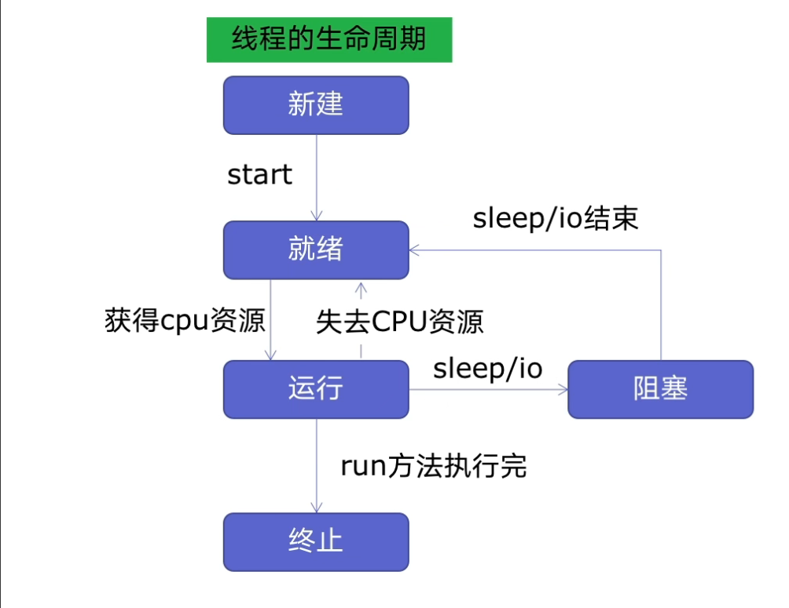
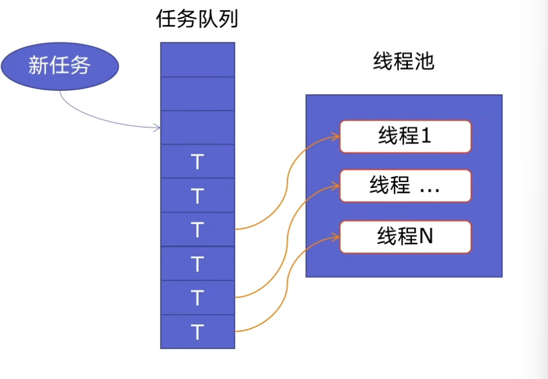
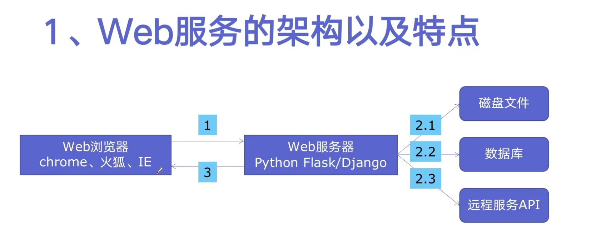

# Python 线程池

## 线程池原理

**线程的生命周期：**



新建线程系统需要分配资源，终止线程系统需要回收资源，如果可以重用线程，则可以减去新建/终止开销。



## 使用线程池好处

- **提升性能：** 因为减去了大量新建、终止线程的开销，重用了线程资源。
- **使用场景： **适合处理突发大量请求或需要大量线程完成任务、但实际任务处理时间很短。
- **防御功能： **能够有效避免系统因为创建线程过多，而导致系统负荷过大相应变慢问题。
- **代码优势：** 使用线程池的语法比自己新建线程执行线程更简洁。

## 线程池的使用

**方法一： **map 函数，注意 map 的结果和入参的顺序的对应的。

**方法二：** future 模式，更强大，注意 as_completed 顺序是随机的。

```python
import threading
from concurrent.futures import ThreadPoolExecutor, as_completed

import requests

data = [
    {"CategoryType": "SiteHome",
     "ParentCategoryId": 0,
     "CategoryId": 808,
     "PageIndex": i,
     "TotalPostCount": 2000,
     "ItemListActionName": "AggSitePostList"}
    for i in range(1, 101)
]
url = "https://www.cnblogs.com/AggSite/AggSitePostList"


# 定义线程需要做的任务函数
def reps(datas):
    rep = requests.post(url, json=datas)
    return f"第{datas['PageIndex']}页获取数据：{len(rep.text)}"


# 方法一
def one():
    # 10表示线程池创建10个线程
    with ThreadPoolExecutor(10) as pool:
        results = pool.map(reps, data)
        for result in results:
            print(threading.current_thread().name, result)


# 方法二
def two():
    with ThreadPoolExecutor(10) as pool:
        futures = [
            pool.submit(reps, datas)
            for datas in data
        ]
        # 两种结果的输出方式
        # 第一种按顺序会等待全部线程结束然后for循环遍历结果、
        # 第二种会实时输出结果
        # 第一种
        # for future in futures:
        #     print(threading.current_thread().name, future.result())
        # 第二种
        for future in as_completed(futures):
            print(threading.current_thread().name, future.result())


if __name__ == '__main__':
    # one()
    two()

```

## 使用线程池实现 flask web 服务加速



**web 服务特点：**

- web 服务对相应时间要求非常高。
- web 服务有大量的依赖 IO 操作的调用。
- web 服务经常要处理很多人的同时请求。

**不使用线程池：**

```python
import json

import flask
import time

app = flask.Flask(__name__)


def read_file():
    time.sleep(0.1)
    return "file result"


def read_db():
    time.sleep(0.3)
    return "db result"


def read_api():
    time.sleep(0.2)
    return "api result"


@app.route("/")
def index():
    result_file = read_file()
    result_db = read_db()
    result_api = read_api()

    return json.dumps({
        "result_file": result_file,
        "result_db": result_db,
        "result_api": result_api
    })


if __name__ == '__main__':
    app.run()
```

**使用线程池：**

```python
import json

import flask
import time
from concurrent.futures import ThreadPoolExecutor

app = flask.Flask(__name__)


def read_file():
    time.sleep(0.1)
    return "file result"


def read_db():
    time.sleep(0.3)
    return "db result"


def read_api():
    time.sleep(0.2)
    return "api result"


@app.route("/")
def index():
    result_file = pool.submit(read_file)
    result_db = pool.submit(read_db)
    result_api = pool.submit(read_api)

    return json.dumps({
        "result_file": result_file.result(),
        "result_db": result_db.result(),
        "result_api": result_api.result()
    })


if __name__ == '__main__':
    pool = ThreadPoolExecutor(3)
    app.run()

```
