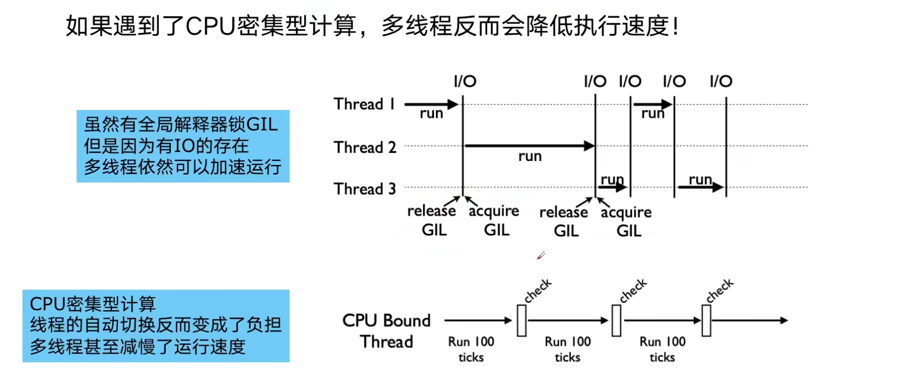
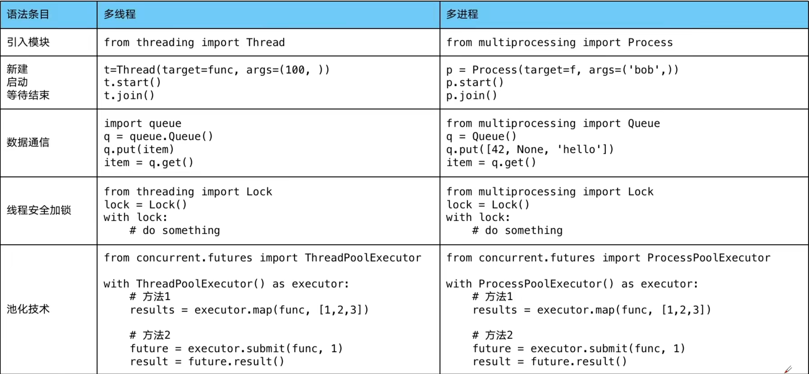

# Python 多进程、进程池



多进程（multiprocessing）模块为了解决 GIL 缺陷问题引入的模块，原理是用多进程在多个 CPU 上执行



## CPU 密集计算单线程、多线程、多进程对比

```python
import math
import time
from concurrent.futures import ThreadPoolExecutor, ProcessPoolExecutor

num = [112272535095293] * 100


# 判断一组数字是否为素数
def is_prime(n):
    if n < 2:
        return False
    if n == 2:
        return True
    if n % 2 == 0:
        return True
    sqrt_n = int(math.floor(math.sqrt(n)))
    for i in range(3, sqrt_n + 1, 2):
        if n % i == 0:
            return False


# 单线程
def single_thread():
    for nuber in num:
        is_prime(nuber)


# 多线程
def mutil_thread():
    with ThreadPoolExecutor() as pool:
        pool.map(is_prime, num)


# 多进程
def mutil_process():
    with ProcessPoolExecutor() as pool:
        pool.map(is_prime, num

if __name__ == '__main__':
    start = time.time()
    single_thread()
    end = time.time()
    print("single_thread", end - start, "seconds")

    start = time.time()
    mutil_thread()
    end = time.time()
    print("mutil_thread", end - start, "seconds")

    start = time.time()
    mutil_process()
    end = time.time()
    print("mutil_thread", end - start, "seconds")


# 执行结果
# single_thread 15.13047170639038 seconds
# mutil_thread 15.428033828735352 seconds
# mutil_thread 1.6441633701324463 seconds
```

## flask web 服务使用进程池加速

```python
import flask
import math
import json
from concurrent.futures import ProcessPoolExecutor


pool = ProcessPoolExecutor()
app = flask.Flask(__name__)


def is_prime(n):
    if n < 2:
        return False
    if n == 2:
        return True
    if n % 2 == 0:
        return True
    sqrt_n = int(math.floor(math.sqrt(n)))
    for i in range(3, sqrt_n + 1, 2):
        if n % i == 0:
            return False


@app.route("/is_prime/<numbers>")
def api_is_prime(numbers):
    number_list = [int(x) for x in numbers.split(",")]
    result = pool.map(is_prime, number_list)
    return json.dumps(dict(zip(number_list, result)))


if __name__ == '__main__':
    app.run()

```
