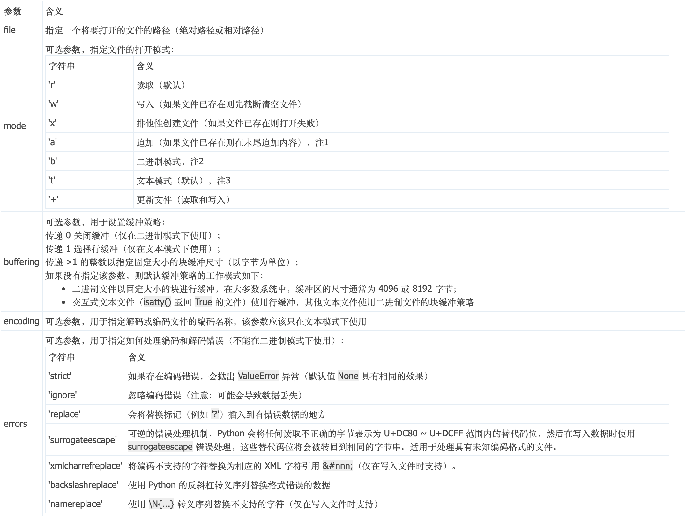
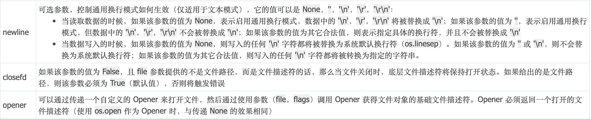

# open 模块

> `open()` 函数用于打开一个文件并返回其对应的文件对象。
>

## 模块解析

**创建文件对象：**

**语法：** `open(file, mode='r', buffering=-1, encoding=None, errors=None, newline=None, closefd=True, opener=None)`

**参数解析：**

**注意 1：** 在某些 Unix 系统中，无论当前文件指针位于什么位置，所有的写入操作都将追加到文件末尾。
**注意 2：** 如果需要读写原生字节格式，请使用二进制模式，并且不要去指定 encoding 参数。
**注意 3：** 如果未指定 encoding 参数，则会根据当前平台决定编码格式，可以通过调用 locale.getpreferredencoding(False) 获取当前的编码。

**返回值：**

1. 如果指定的文件成功打开，则返回其对应的文件对象。

2. 如果指定的文件无法打开，则抛出 OSError 异常。

## 文件对象各种方法

| **方法**                    | **含义**                                                                                                                                                                                                                          |
| --------------------------- | --------------------------------------------------------------------------------------------------------------------------------------------------------------------------------------------------------------------------------- |
| f.close()                   | 关闭文件对象                                                                                                                                                                                                                      |
| f.flush()                   | 将文件对象中的缓存数据写入到文件中（不一定有效）                                                                                                                                                                                  |
| f.read(size=-1, /)          | 从文件对象中读取指定数量的字符（或者遇到 EOF 停止）；当未指定该参数，或该参数为负值的时候，读取剩余的所有字符                                                                                                                     |
| f.readable()                | 判断该文件对象是否支持读取（如果返回的值为 False，则调用 read() 方法会导致 OSError 异常）                                                                                                                                         |
| f.readline(size=-1, /)      | 从文件对象中读取一行字符串（包括换行符），如果指定了 size 参数，则表示读取 size 个字符                                                                                                                                            |
| f.readlines(size=-1, /)     | 从文件对象中读取所有字符串（包括换行符），然后按行为单位存储到列表中 如果指定了 size 参数，则表示读取 size 个字符（如果 size 参数指定的字符个数少于第一行字符个数，则仍然存放第一行字符，其他行也一样，它是按 “行” 为单位存储的） |
| f.seek(offset, whence=0, /) | 修改文件指针的位置，从 whence 参数指定的位置（0 代表文件起始位置，1 代表当前位置，2 代表文件末尾）偏移 offset 个字节，返回值是新的索引位置                                                                                        |
| f.seekable()                | 判断该文件对象是否支持修改文件指针的位置（如果返回的值为 False，则调用 seek()，tell()，truncate()方法都会导致 OSError 异常）                                                                                                      |
| f.tell()                    | 返回当前文件指针在文件对象中的位置                                                                                                                                                                                                |
| f.truncate(pos=None, /)     | 将文件对象截取到 pos 的位置，默认是截取到文件指针当前指定的位置                                                                                                                                                                   |
| f.write(text, /)            | 将字符串写入到文件对象中，并返回写入的字符数量（字符串的长度）                                                                                                                                                                    |
| f.writable()                | 判断该文件对象是否支持写入（如果返回的值为 False，则调用 write() 方法会导致 OSError 异常）                                                                                                                                        |
| f.writelines(lines, /)      | 将一系列字符串写入到文件对象中（不会自动添加换行符，所以通常是人为地加在每个字符串的末尾）                                                                                                                                        |
